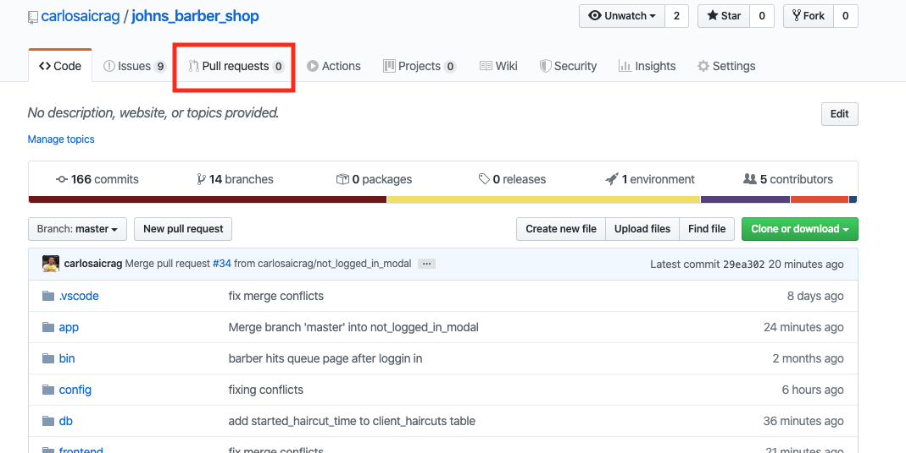
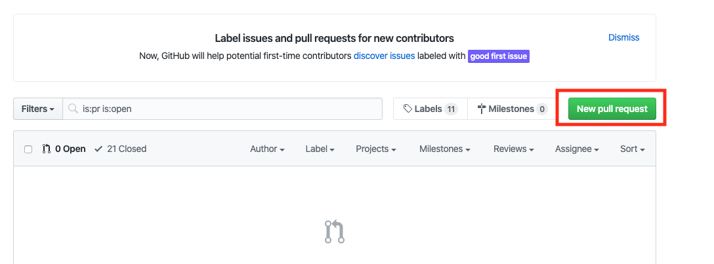
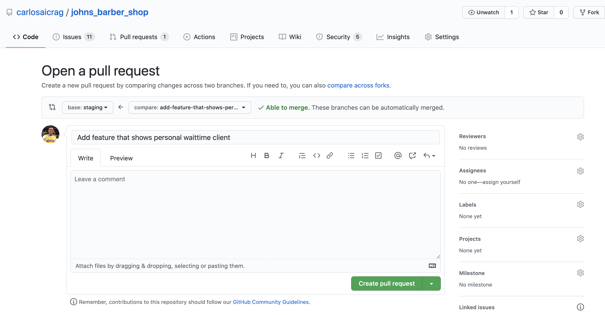

# Johns Barber Shop 
[Johns Barber Shop](http://johns-barber-shop.herokuapp.com/#/)

* Welcome to Johns Barber Shop repository.

# Project Description

Application that shows users how long it will take them to get a haircut with a certain barber.

Let’s think of a scenario. Someone comes into the shop and wants a haircut.  First of all, the user will have to pick what kind of haircut that they want.  This will be done on the users phone where they will have to login so they can choose what kind of haircut they want. Then they will get to pick which barber that they get to go to. 

There will be two sides to this app, the barber side and the user client side. The barber gets to see who is in their queue.  Barbers will also be able to remove clients once they are done giving them a hair cut.  Users will see approximately how long it will take each barber to be done with their haircut. 

# MVP List
<ol>  
<li>
Barber User Auth
</li> 
<li>
Page where users are able to pick their type of haircut and the barber they want to give them a haircut.
</li>
<li>
Page where barbers are able to see how many people are in their queue and are also able to take people off of their queue once they are done with a haircut.
</li> 
<li>
Home page where users see how long it will take to get a haircut for each barber.
</li>

# Workflow
1. git pull staging 
2. git checkout -b `<github issue number>-<name of branch>` (you are branching off of staging)
3. work on feature 
4. once you are done 
    * checkout the staging branch
    * git pull on staging branch
    * checkout YOUR feature branch
    * git rebase staging
    * fix merge conflicts if they exist
    * git push
    * if you have any issues please let someone know
    * do the command that the terminal says to do
    * your branch should now be in the remote repository
5. create a pull request on github 
    
    
    
    * what we're doing here is requesting to pull in our branch into the staging branch.  The base in the third picture will always be staging, and what we're comparing is the branch we're requesting to be pulled in.  Once we make sure that the feature is working in the staging branch then we go ahead and merge to master in another pull request. 
# How To Use
* git pull the repository 
* bundle install
* npm install
* rails db:setup
* rails db:migrate
* rails db:seed 
* rails s on a new terminal tab
* npm start on another new terminal tab

* let's make a cool app!