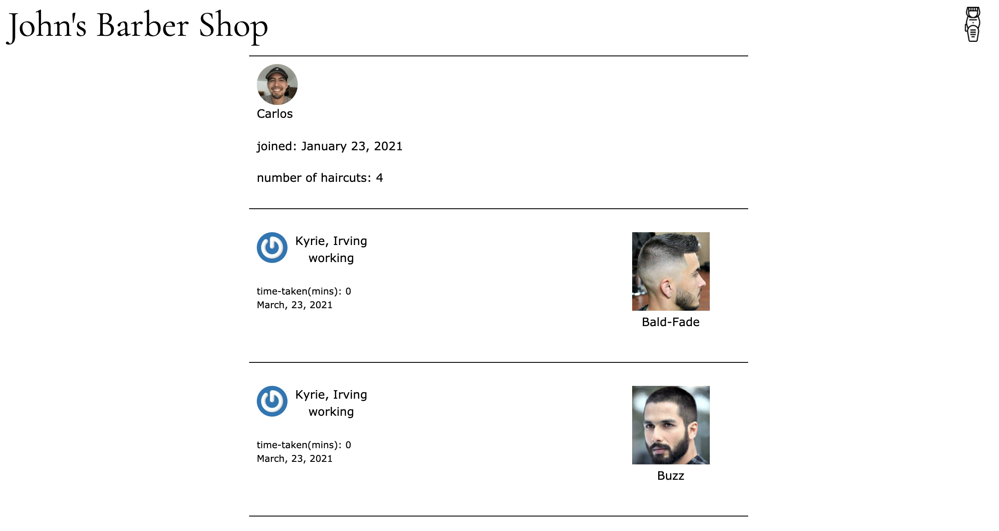

# Johns Barber Shop 
[Johns Barber Shop](http://johns-barber-shop.herokuapp.com/#/)

* Welcome to Johns Barber Shop repository.

# Project Description

<p>
Application that shows users how long it will take them to get a haircut with a certain barber.

Let’s think of a scenario. Someone comes into the shop and wants a haircut.  First of all, the user will have to pick what kind of haircut that they want.  This will be done on the users phone where they will have to login so they can choose what kind of haircut they want. Then they will get to pick which barber that they get to go to. 

There will be two sides to this app, the barber side and the user client side. The barber gets to see who is in their queue.  Barbers will also be able to remove clients once they are done giving them a hair cut.  Users will see approximately how long it will take each barber to be done with their haircut. 
</p>





<p>
Below we a part of the algorithm that allows users to see how long until they are up for a haircut.  This happens once a client finds a hairstyle and barber to cut their hair.  The information reaces this controller action where it then creates a new ClientHaircut object.  The controller action also looks for the combination of information in another table called the client_haircut_times through the line `ClientHaircutTime.avg_time`.  If it finds a row in the table then it returns it, but if it doesnt, then it creates a new row and saves it to the table.  This newly created row has a default avg_time of 45 minutes.  The 45 minutes is important because it will allow other clients to see an updated queue. This is how other clients see how long it will be until they are up for a haircut. 
</p>

``` ruby
def create
  @client_haircut = ClientHaircut.new(client_haircut_params)
  @client_haircut.client_id = current_client_user.id
  haircut_id = params[:client_haircut][:haircut_id]
  barber_id = params[:client_haircut][:barber_id]
  @client_haircut_avg_time = ClientHaircutTime.avg_time(current_client_user.id,haircut_id,barber_id,client_haircut_params)

  @client_haircut_avg_time.client_id = current_client_user.id
  if ClientHaircut.client_already_in_a_queue?(current_client_user)
      render json: ["You are already in a barbers queue"], status: 402
  elsif @client_haircut.save and @client_haircut_avg_time.save
      render :show
  else
      render json: @client_haircut.errors.full_messages, status: 402
  end
end
```

<p>
After the client has finished with their haircut then we are taken to the controller action seen below.  This controller action is responsible for closing the client_haircut and updating the avg time it takes to do the haircut that the client got. If it took a total time of 20 minutes or more, then we will update the table, but if it did not then we will keep the previous avg time it took to get a haircut. 

</p>

```ruby 
def close_client_haircut
  @client_haircut = ClientHaircut.find_by(id: params[:id])
  @client_haircut.release_client
  ClientHaircutTime.update_avg(@client_haircut)
  Barber.change_working_status(current_barber)
  @client_haircuts = ClientHaircut.where(barber_id: current_barber.id).where(closed_at: [nil]).order('created_at ASC')
  render :queue
end
```