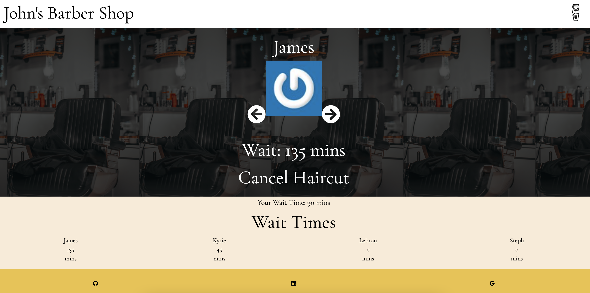
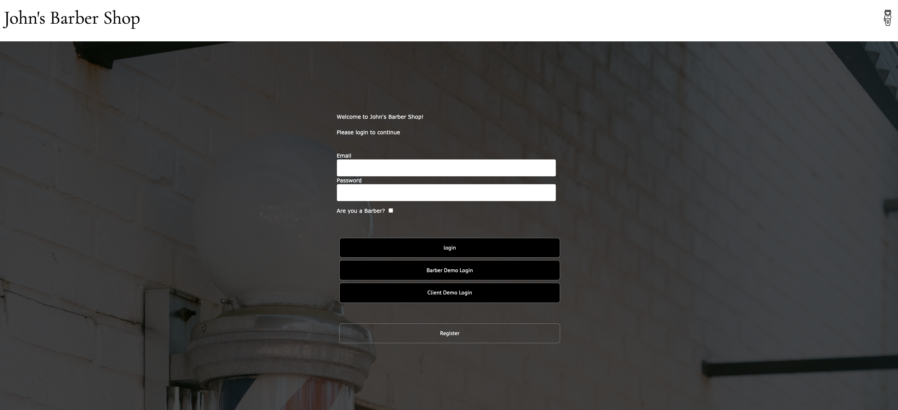
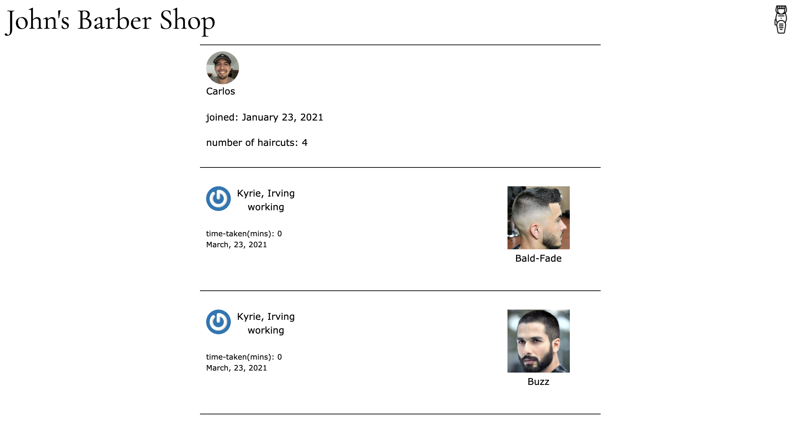
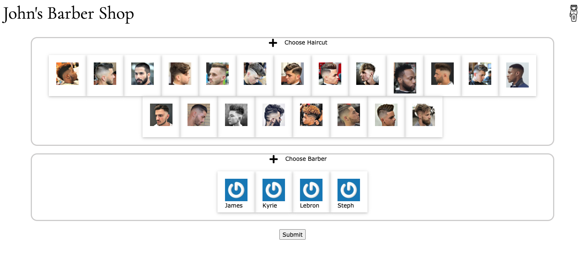
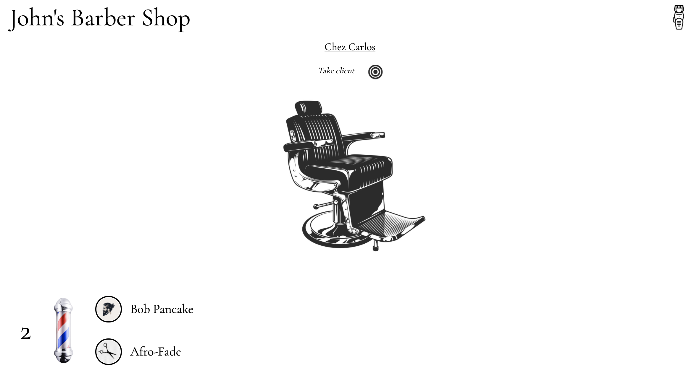
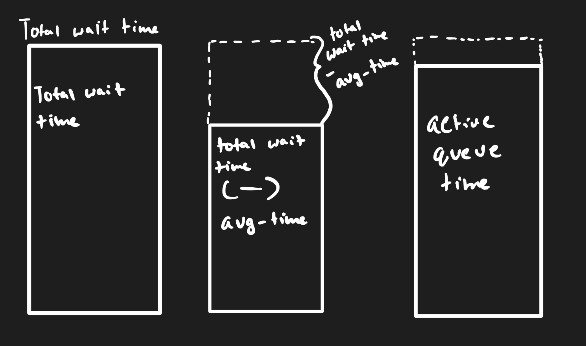

# W4D2

### Johns Barber Shop
---
### Agenda
* Show images of website 
* demo out project
* Highlights of Project 
  * Backend
  * Frontend
* Conclusion
---
### Main page



---
### Login Page



---

### Clients Profile Page 



---
### Picking a Haircut


---
### Barbers Queue



---
### Demo
---
### Backend

---
### Barbers Table

| id      | password_digest | session_token | email  | fname  | lname  | working | cutting_hair |
|---------|-----------------|---------------|--------|--------|--------|---------|--------------|
| integer | string          | string        | string | string | string | boolean | boolean      |


---
### Clients Table

| id      | password_digest | session_token | email  | fname  | lname  |
|---------|-----------------|---------------|--------|--------|--------|
| integer | string          | string        | string | string | string |


---
### Haircuts Table

| id      | haircut_name | path   |
|---------|--------------|--------|
| integer | string       | string |
|         |              |        |
|         |              |        |

---
### ClientHaircuts Table 

| id      | client_id | haircut_id | barber_id | closed_at | started_haircut_time |
|---------|-----------|------------|-----------|-----------|----------------------|
| integer | integer   | integer    | integer   | datetime  | datetime             |
|         |           |            |           |           |                      |
|         |           |            |           |           |                      |


---
### ClientsHaircutsTimes table

| id      | client_id | haircut_id | barber_id | avg_time            |
|---------|-----------|------------|-----------|---------------------|
| integer | integer   | integer    | integer   | integer default: 45 |

---
### Rendering the Main Page Controller
```ruby 

def index
    @barbers = Barber.where(working: true)
    @current_client_user = current_client_user
end

```
---
### Rendering the Main Page api payload

```ruby 
json.barbers do 
    @barbers.each do |barber|
        json.set! barber.id do 
            json.partial! "api/barbers/barber", barber:barber
            json.barberGravitar barber.gravitar
            if barber.cutting_hair
                json.queueTime barber.active_queue_time
                json.avgTime barber.current_client_cutting_hair_avg_time
            else
                json.queueTime barber.wait_time
                json.avgTime 0
            end
            json.totalWaitTime barber.wait_time
        end
    end
end

json.clientHaircuts do
    ClientHaircut.where(closed_at: nil).each do |client_haircut|
        json.set! client_haircut.id do 
            json.extract! client_haircut, :id, :barber_id, :client_id, :haircut_id
        end
    end
end

json.clients do 
    if @current_client_user
        if @current_client_user.in_queue?
            json.set! @current_client_user.id do 
                json.partial! "api/clients/client", client: @current_client_user
                json.waitTime @current_client_user.wait_time
            end
        end
    end
    json.duck "duck"
end
```

---

### creating a new Clienthaircuts Row 

``` ruby
def create
  @client_haircut = ClientHaircut.new(client_haircut_params)
  @client_haircut.client_id = current_client_user.id
  haircut_id = params[:client_haircut][:haircut_id]
  barber_id = params[:client_haircut][:barber_id]
  @client_haircut_avg_time = ClientHaircutTime.avg_time(current_client_user.id,haircut_id,barber_id,client_haircut_params)

  @client_haircut_avg_time.client_id = current_client_user.id
  if ClientHaircut.client_already_in_a_queue?(current_client_user)
      render json: ["You are already in a barbers queue"], status: 402
  elsif @client_haircut.save and @client_haircut_avg_time.save
      render :show
  else
      render json: @client_haircut.errors.full_messages, status: 402
  end
end
```


### closing a clienthaircut
* on the barbers queue page we will be closing the current haircut that the barber is on and then returning a new queue with clients placed in the correct order. 
``` ruby 
def close_client_haircut
  @client_haircut = ClientHaircut.find_by(id: params[:id])
  @client_haircut.release_client
  ClientHaircutTime.update_avg(@client_haircut)
  Barber.change_working_status(current_barber)
  @client_haircuts = ClientHaircut.where(barber_id: current_barber.id).where(closed_at: [nil]).order('created_at ASC')
  render :queue
end
```

---
### Frontend 
---

### Sample State 

# Sample State
``` java
{
  entities:{
    barbers:{
      6: {
        fname: "Damian",
        lname: "Lillard",
        currentClientStarttime: 
          avg_time: 0,
          hour: 0,
          minute: 0,
          second: 0
        },
        cutting_hair: true,
        gravitar: "fjdksa;fjdska"
        queueTime: 70
        working: true
      },
      7: {
        fname: "James",
        lname: "Harden",
        currentClientStarttime: {
          avg_time: 0,
          hour: 0,
          minute: 0,
          second: 0
        },
        cutting_hair: false,
        gravitar: "fjdksa;fjdsfdaska"
        queueTime: 90
        working: true
      },
    },
    queue:{ // information about queue for barber 
      id: 6,
      clientFirstName: "Bob",
      clientHaircut: "Afro-Fade",
      clientLastName: "Pancake",
      queueLenght: 2,
    },
    haircuts:{
      22: {
        id: 22,
        haircut_name: "Afro_Fade",
        path: "./Afro-Fade-Haircut.jpg"
      },
      23: {
        id: 23,
        haircut_name: "Bald_Fade",
        path: "./Bald-Fade-Haircut.jpg"
      }
    }
  },
    clientHaircuts:{
      7: {
        id: 7,
        barber_id: 6,
        client_id: 8,
        haircut_id: 24
      },
      8: {
        id: 8,
        barber_id: 7,
        client_id: 9,
        haircut_id: 22
      },
    }
  },
  ui: {
    modal: {
      type: "OPEN_NAV_MODAL"
    }
  },
  errors: {
    session: ["Invalid Credentials"]
  },
  session: {
    id: null,
    clientId: 12
  }
}
```
---

### Main page

```javascript 
function componentDidMount() {
  //
  //
  //
  barberIds.forEach((barberId) => {
        let barber = payload.barbers[barberId]
        let timeLimit = barber.totalWaitTime - barber.avgTime
        this.state[barberId] = barber.queueTime
        this.setState({ [barberId]: barber.queueTime })

        let interval = setInterval(() => {
          if (this.state[barberId] != 0 && this.state[barberId] > timeLimit) {
            this.setState({ [barberId]: this.state[barberId] - 1 })
          } else {
            clearInterval(interval)
          }
        }, 60000)

        this.barberIntervals.push(interval)
      })
    })
}

```
---
### Visual of Logic


---